# 📊 Diagrama de Flujo del Despliegue

## 🔄 Proceso Completo de Despliegue en Easypanel

```mermaid
graph TD
    A[Inicio: Proyecto CRM Local] --> B{¿Código en GitHub?}
    B -->|No| C[Subir código a GitHub]
    B -->|Sí| D[Crear Base de Datos en Easypanel]
    C --> D
    
    D --> E[PostgreSQL: restaurant_crm]
    E --> F[Obtener DATABASE_URL]
    
    F --> G[Crear Aplicación en Easypanel]
    G --> H[Configurar: GitHub + Docker]
    H --> I[Set Variables de Entorno]
    
    I --> J[Deploy Inicial]
    J --> K{¿Build Exitoso?}
    K -->|No| L[Revisar Logs]
    L --> M[Corregir Errores]
    M --> J
    K -->|Sí| N[Ejecutar Migraciones]
    
    N --> O{¿BD Conectada?}
    O -->|No| P[Verificar DATABASE_URL]
    P --> N
    O -->|Sí| Q[Aplicación Online]
    
    Q --> R[Configurar Dominio]
    R --> S[Activar Auto-Deploy]
    S --> T[¡CRM en Producción!]
    
    T --> U{¿Nuevos Cambios?}
    U -->|Sí| V[git push]
    V --> W[Auto-Deploy Actualiza]
    W --> T
    U -->|No| T
```



## 🏗️ Arquitectura del Sistema en Easypanel

```mermaid
graph TB
    subgraph "Easypanel Server"
        subgraph "Application Container"
            APP[CRM App<br/>Next.js<br/>Port: 3000]
            APP --> HEALTH[/api/health]
            APP --> API[/api/*]
        end
        
        subgraph "Database Container"
            PG[(PostgreSQL<br/>restaurant_crm<br/>Port: 5432)]
        end
        
        subgraph "Redis Container"
            REDIS[(Redis<br/>Cache<br/>Port: 6379)]
        end
        
        subgraph "Storage"
            UPLOADS[Uploads<br/>./public/uploads]
            BACKUPS[Backups<br/>Automáticos]
        end
    end
    
    subgraph "External"
        GITHUB[GitHub<br/>Repository]
        DOMAIN[tu-dominio.com<br/>HTTPS]
        USER[Usuario Final]
    end
    
    GITHUB --> APP
    APP --> PG
    APP --> REDIS
    APP --> UPLOADS
    PG --> BACKUPS
    
    USER --> DOMAIN
    DOMAIN --> APP
    
    HEALTH -.-> APP
```

## 📋 Flujo de Migraciones de Base de Datos


## 🔄 Ciclo de Vida de Actualizaciones

```mermaid
graph LR
    subgraph "Desarrollo"
        DEV[Desarrollo Local]
        TEST[Testing Local]
        COMMIT[git commit]
    end
    
    subgraph "GitHub"
        PUSH[git push]
        BUILD[Build Automático]
    end
    
    subgraph "Easypanel"
        DEPLOY[Deploy Automático]
        HEALTH_CHECK[Health Check]
        ROLLBACK[Rollback si falla]
    end
    
    subgraph "Producción"
        APP_RUNNING[App Funcionando]
        MONITORING[Monitoreo]
    end
    
    DEV --> TEST
    TEST --> COMMIT
    COMMIT --> PUSH
    PUSH --> BUILD
    BUILD --> DEPLOY
    DEPLOY --> HEALTH_CHECK
    HEALTH_CHECK -->|Éxito| APP_RUNNING
    HEALTH_CHECK -->|Falla| ROLLBACK
    APP_RUNNING --> MONITORING
    MONITORING --> DEV
```



## 📊 Recursos y Monitoreo


## 🚨 Flujo de Manejo de Errores


---

## 🎯 Puntos Críticos de Éxito

### ✅ Must-Have para Despliegue Exitoso:

1. **`next.config.ts` con `output: 'standalone'`**
2. **Dockerfile optimizado para producción**
3. **Endpoint `/api/health` funcionando**
4. **Variables de entorno configuradas correctamente**
5. **Base de datos PostgreSQL creada previamente**

### ⚠️ Puntos de Falla Comunes:

1. **Build falla**: Dependencias faltantes o configuración incorrecta
2. **App no inicia**: Variables de entorno incorrectas
3. **BD no conecta**: URL mal configurada o PostgreSQL no disponible
4. **Migraciones fallan**: Schema incompatible o permisos

### 🔧 Herramientas de Monitoreo:

1. **Logs en Easypanel**: Tiempo real
2. **Health Check**: Automático cada 30s
3. **Métricas**: CPU, RAM, Disco
4. **Backups**: Automáticos diarios

---

## 📈 Métricas de Despliegue Esperado

| Métrica | Valor Esperado | Umbral de Alerta |
|---------|----------------|------------------|
| **Tiempo de Deploy** | 3-5 minutos | >10 minutos |
| **Uso de RAM** | 512MB - 1GB | >1.5GB |
| **Uso de CPU** | 5-20% | >80% |
| **Tiempo de Respuesta** | <200ms | >1s |
| **Uptime** | 99.9% | <99% |

---

**Este diagrama te ayuda a visualizar todo el proceso y anticipar posibles problemas.** 🎯