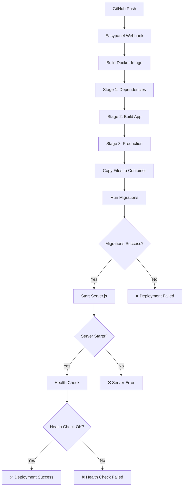
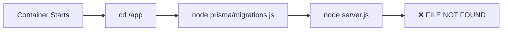
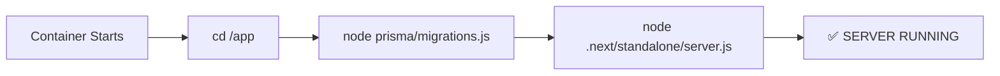
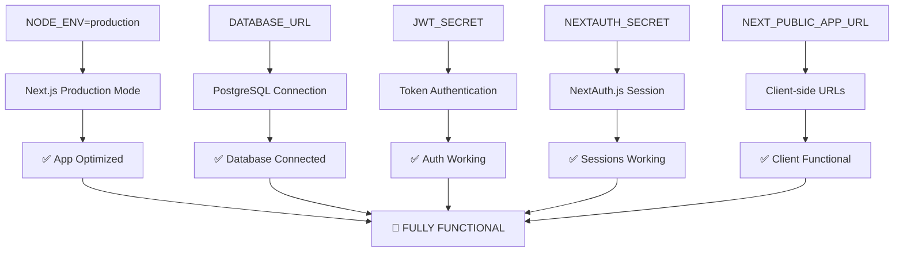
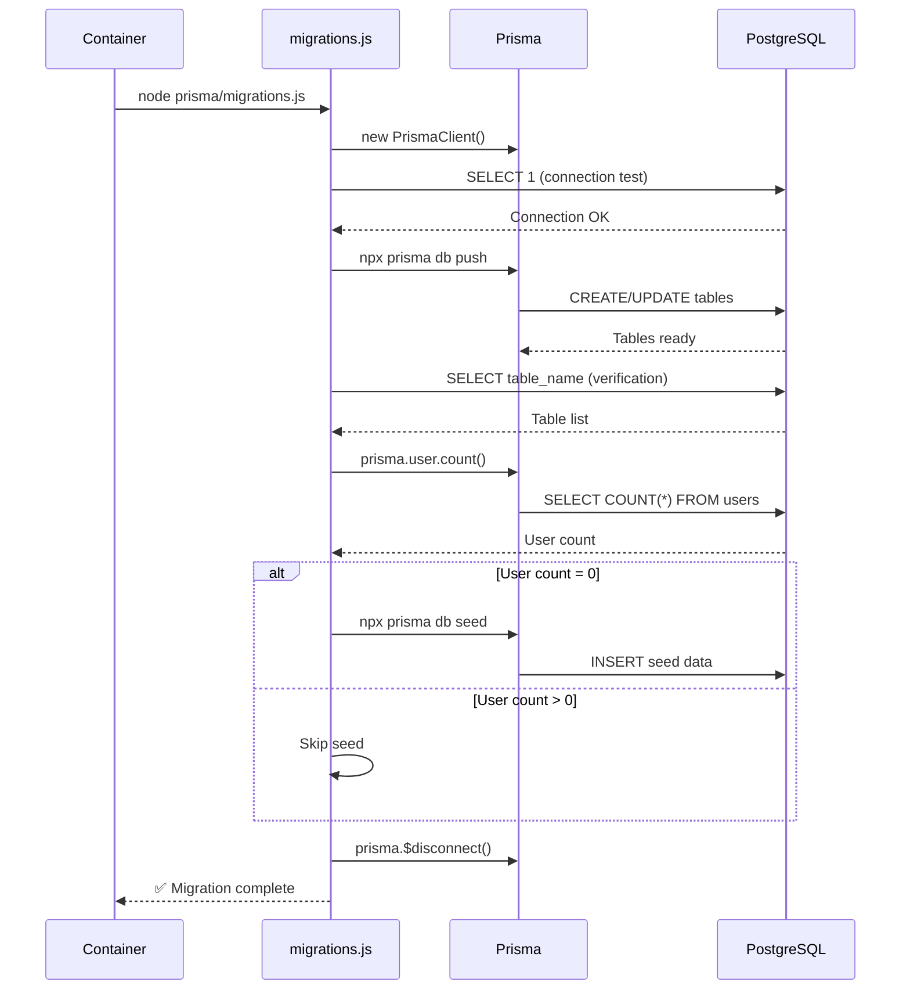

# 🔄 DIAGRAMA DE FLUJO DE DESPLIEGUE - EASYPANEL

## 📊 VISUALIZACIÓN DEL PROCESO



## 🎯 PUNTOS CRÍTICOS DE FALLA

### 1. **Build Docker Image** 
- **Problema:** Dependencias faltantes
- **Solución:** Verificar `package.json` y `package-lock.json`

### 2. **Stage 2: Build App**
- **Problema:** Errores de TypeScript o ESLint
- **Solución:** `ignoreBuildErrors: true` en `next.config.ts`

### 3. **Copy Files to Container**
- **Problema:** Rutas incorrectas en Dockerfile
- **Solución:** Verificar paths en `COPY` commands

### 4. **Run Migrations** ⚠️ **PUNTO MÁS CRÍTICO**
- **Problema:** Script de migraciones con comandos Unix específicos
- **Solución:** Usar comandos compatibles con Alpine Linux

### 5. **Start Server.js** ⚠️ **ERROR ACTUAL**
- **Problema:** `node server.js` no encuentra el archivo
- **Solución:** Cambiar a `node .next/standalone/server.js`

### 6. **Health Check**
- **Problema:** Puerto incorrecto o ruta no accesible
- **Solución:** Verificar `EXPOSE 3000` y ruta `/api/health`

## 🔍 ANÁLISIS DE TU ERROR ACTUAL

Basado en tu descripción, el error ocurre en el paso **"Start Server.js"**:

```
❌ ERROR: node server.js
✅ SOLUCIÓN: node .next/standalone/server.js
```

## 📋 FLUJO CORRECTO VS INCORRECTO

### ❌ FLUJO INCORRECTO (ACTUAL)


### ✅ FLUJO CORRECTO (CORREGIDO)


## 🚨 VARIABLES DE ENTORNO CRÍTICAS



## 🛠️ ESTRUCTURA DE ARCHIVOS EN CONTENEDOR

### Antes de la corrección:
```
/app/
├── prisma/
│   └── migrations.js
├── .next/
│   └── standalone/
│       ├── server.js  ← EXISTE PERO NO SE USA
│       └── node_modules/
├── node_modules/
└── ❌ server.js     ← NO EXISTE EN RAÍZ
```

### Después de la corrección:
```
/app/
├── prisma/
│   └── migrations.js
├── .next/
│   └── standalone/
│       ├── server.js  ← ✅ SE USA CORRECTAMENTE
│       └── node_modules/
├── node_modules/
└── ✅ .next/standalone/server.js  ← RUTA CORRECTA
```

## 🔄 PROCESO DE MIGRACIÓN DETALLADO



## 🎯 CHECKLIST DE DESPLIEGUE

### ✅ Pre-Despliegue
- [ ] `package.json` actualizado
- [ ] `next.config.ts` con `output: 'standalone'`
- [ ] `prisma/schema.prisma` con `binaryTargets` correctos
- [ ] Variables de entorno configuradas en Easypanel

### ✅ Build
- [ ] Dockerfile ejecuta todas las etapas correctamente
- [ ] `npm run build` termina sin errores críticos
- [ ] Archivos copiados a las rutas correctas

### ✅ Runtime
- [ ] Migraciones se ejecutan sin errores
- [ ] Server.js inicia correctamente
- [ ] Health check responde en `/api/health`
- [ ] Aplicación accesible en el dominio

## 🚨 ERRORES COMUNES Y SOLUCIONES

| Error | Causa | Solución |
|-------|--------|----------|
| `server.js not found` | Ruta incorrecta en CMD | Usar `.next/standalone/server.js` |
| `Permission denied` | Permisos incorrectos | Agregar `chown` y `chmod` en Dockerfile |
| `Database connection failed` | DATABASE_URL incorrecta | Verificar URL y credenciales |
| `PrismaClientUnknownRequestError` | Schema no aplicado | Ejecutar `prisma db push` |
| `NEXTAUTH_SECRET missing` | Variable no configurada | Agregar a Easypanel |

---

## 🏆 CONCLUSIÓN

El problema principal es la **ruta incorrecta al servidor** en el Dockerfile. Una vez corregido esto, el despliegue debería funcionar correctamente.

**Orden de prioridad para las correcciones:**
1. 🥇 **Corregir ruta a server.js** (CRÍTICO)
2. 🥈 **Agregar NEXTAUTH_SECRET** (IMPORTANTE)
3. 🥉 **Optimizar script de migraciones** (RECOMENDADO)