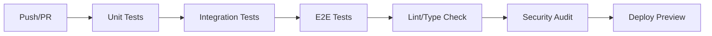

# Sistema de Pruebas

Este documento describe el sistema de pruebas implementado para la aplicación CRM de Restaurantes.

## Tabla de Contenidos

1. [Tipos de Pruebas](#tipos-de-pruebas)
2. [Configuración del Entorno](#configuración-del-entorno)
3. [Ejecución de Pruebas](#ejecución-de-pruebas)
4. [Estructura de Pruebas](#estructura-de-pruebas)
5. [Mocks y Fixtures](#mocks-y-fixtures)
6. [Cobertura de Código](#cobertura-de-código)
7. [CI/CD](#cicd)

## Tipos de Pruebas

### 1. Pruebas Unitarias
- **Propósito**: Probar unidades individuales de código (funciones, clases, componentes)
- **Herramientas**: Jest, React Testing Library
- **Ubicación**: `src/**/__tests__/`
- **Ejemplos**:
  - Utilidades (`src/lib/utils/__tests__/`)
  - Servicios (`src/lib/auth/__tests__/`)
  - Componentes de UI (`src/components/ui/__tests__/`)

### 2. Pruebas de Integración
- **Propósito**: Probar la interacción entre múltiples componentes o módulos
- **Herramientas**: Jest, Supertest
- **Ubicación**: `src/app/api/**/__tests__/`
- **Ejemplos**:
  - Endpoints de API (`src/app/api/auth/__tests__/`)
  - Integración con base de datos

### 3. Pruebas End-to-End (E2E)
- **Propósito**: Probar flujos completos de usuario desde la interfaz
- **Herramientas**: Playwright
- **Ubicación**: `e2e/`
- **Ejemplos**:
  - Flujo de login y registro
  - Creación de reservas
  - Gestión de mesas

## Configuración del Entorno

### Dependencias de Testing

Las siguientes dependencias están configuradas en `package.json`:

```json
{
  "devDependencies": {
    "@playwright/test": "^1.48.0",
    "@testing-library/jest-dom": "^6.6.3",
    "@testing-library/react": "^16.0.1",
    "@testing-library/user-event": "^14.5.2",
    "@types/jest": "^29.5.14",
    "jest": "^29.7.0",
    "jest-environment-jsdom": "^29.7.0",
    "msw": "^2.3.5",
    "supertest": "^7.0.0"
  }
}
```

### Configuración de Jest

- **Archivo**: `jest.config.js`
- **Setup**: `jest.setup.js`
- **Coverage**: Configurado con umbral del 70%

### Configuración de Playwright

- **Archivo**: `playwright.config.ts`
- **Global Setup**: `e2e/global-setup.ts`
- **Global Teardown**: `e2e/global-teardown.ts`

## Ejecución de Pruebas

### Pruebas Unitarias y de Integración

```bash
# Ejecutar todas las pruebas
npm test

# Ejecutar en modo watch
npm run test:watch

# Ejecutar con cobertura
npm run test:coverage

# Ejecutar en CI (sin watch)
npm run test:ci
```

### Pruebas End-to-End

```bash
# Instalar navegadores de Playwright (solo una vez)
npm run test:e2e:install

# Ejecutar pruebas E2E
npm run test:e2e

# Ejecutar con interfaz gráfica
npm run test:e2e:ui

# Ejecutar en modo debug
npm run test:e2e:debug
```

### Todos los Tests

```bash
# Ejecutar todos los tipos de pruebas
npm run test:all
```

## Estructura de Pruebas

```
src/
├── __tests__/
│   └── utils/
│       └── test-utils.tsx    # Utilidades de testing
├── lib/
│   ├── auth/
│   │   └── __tests__/
│   │       └── index.test.ts # Pruebas de servicio de auth
│   ├── utils/
│   │   └── __tests__/
│   │       └── index.test.ts # Pruebas de utilidades
│   └── services/
│       └── __tests__/        # Pruebas de servicios
├── components/
│   └── ui/
│       └── __tests__/
│           └── Button.test.tsx # Pruebas de componentes
└── app/
    └── api/
        └── auth/
            └── __tests__/
                └── login.test.ts # Pruebas de API

e2e/
├── auth/
│   └── login.spec.ts          # Pruebas E2E de login
├── reservations/
│   └── create.spec.ts         # Pruebas E2E de reservas
├── tables/
│   └── management.spec.ts     # Pruebas E2E de mesas
├── global-setup.ts            # Configuración global
└── global-teardown.ts         # Limpieza global

src/mocks/
├── server.ts                  # Servidor de mocks MSW
└── data.ts                    # Datos de prueba
```

## Mocks y Fixtures

### MSW (Mock Service Worker)

Se utiliza MSW para interceptar peticiones HTTP en pruebas unitarias y de integración:

```typescript
// src/mocks/server.ts
import { setupServer } from 'msw/node'
import { rest } from 'msw'

export const server = setupServer(
  rest.post('/api/auth/login', (req, res, ctx) => {
    // Mock response
  })
)
```

### Datos de Prueba

Los datos de prueba se definen en `src/mocks/data.ts`:

```typescript
export const mockUsers = [
  {
    id: 'user-1',
    email: 'admin@test.com',
    firstName: 'Admin',
    lastName: 'User',
    // ...
  }
]
```

### Mock de Prisma

Se proporciona un mock de Prisma Client para pruebas:

```typescript
// src/__tests__/utils/prisma-mock.ts
export const mockUserFindUnique = (data: any) => {
  mockPrismaClient.user.findUnique.mockResolvedValue(data)
}
```

## Cobertura de Código

### Configuración

La configuración de cobertura está definida en `jest.config.js`:

```javascript
coverageThreshold: {
  global: {
    branches: 70,
    functions: 70,
    lines: 70,
    statements: 70,
  },
}
```

### Reportes

Los reportes de cobertura se generan en:

- **HTML**: `coverage/lcov-report/index.html`
- **LCOV**: `coverage/lcov.info`
- **Texto**: Consola

### Exclusiones

Se excluyen de la cobertura:

- Archivos de tipos (`.d.ts`)
- Archivos de historias (`.stories.{js,jsx,ts,tsx}`)
- Archivos de índice (`index.ts`)

## CI/CD

### GitHub Actions

Las pruebas se ejecutan automáticamente en GitHub Actions:

1. **Unit Tests**: Pruebas unitarias en múltiples versiones de Node.js
2. **Integration Tests**: Pruebas de integración con base de datos
3. **E2E Tests**: Pruebas end-to-end con Playwright
4. **Lint y Type Check**: Verificación de código y tipos
5. **Security Audit**: Auditoría de seguridad de dependencias

### Flujo de CI



### Variables de Entorno

Las siguientes variables de entorno se utilizan en CI:

- `NODE_ENV=test`
- `DATABASE_URL`: URL de base de datos de prueba
- `JWT_SECRET`: Secreto para tokens JWT de prueba

## Buenas Prácticas

### 1. Convenciones de Nomenclatura

- **Archivos**: `*.test.ts` para TypeScript, `*.test.tsx` para React
- **Descripciones**: "should [expected behavior] when [condition]"
- **Grupos**: `describe()` para agrupar pruebas relacionadas

### 2. Estructura de Pruebas

```typescript
describe('Component/Service Name', () => {
  beforeEach(() => {
    // Configuración común
  })

  describe('Method/Feature', () => {
    it('should behave correctly when condition', () => {
      // Arrange
      // Act
      // Assert
    })
  })
})
```

### 3. Mocks y Espías

- Usar mocks para dependencias externas
- Limpiar mocks entre pruebas (`jest.clearAllMocks()`)
- Usar espías para verificar llamadas a funciones

### 4. Datos de Prueba

- Usar datos consistentes y predecibles
- Evitar datos aleatorios en pruebas
- Crear fixtures para datos complejos

### 5. Aserciones

- Ser específicos en las aserciones
- Probar comportamiento esperado y casos límite
- Verificar estado, no solo implementación

## Solución de Problemas

### Problemas Comunes

1. **Tests que fallan intermitentemente**
   - Usar `waitFor` para operaciones asíncronas
   - Evitar dependencias de tiempo real

2. **Mocks que no se aplican**
   - Verificar orden de configuración de mocks
   - Limpiar mocks entre pruebas

3. **Problemas con Playwright**
   - Verificar que los navegadores estén instalados
   - Revisar selectores y esperas

### Depuración

```bash
# Ejecutar tests en modo debug
npm run test:debug

# Ejecutar tests con logs detallados
DEBUG=* npm test

# Ejecutar un test específico
npm test -- --testNamePattern="specific test"
```

## Recursos Adicionales

- [Documentación de Jest](https://jestjs.io/docs/getting-started)
- [Documentación de React Testing Library](https://testing-library.com/docs/react-testing-library/intro)
- [Documentación de Playwright](https://playwright.dev/)
- [MSW Documentation](https://mswjs.io/)