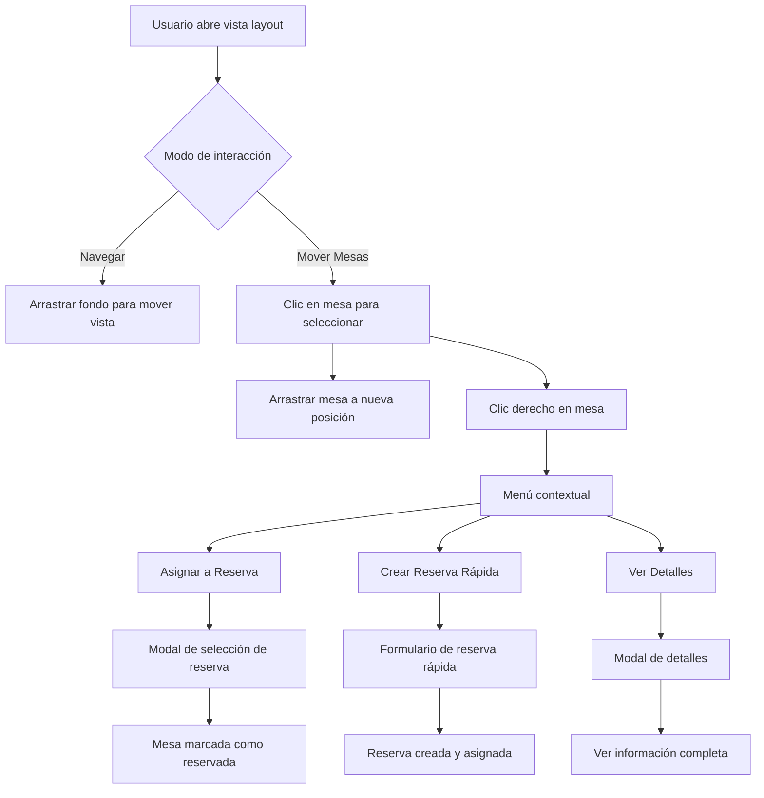

# Plan de Mejoras para la Vista Layout de Mesas

## Problemas Identificados

1. **Asignación de Mesas a Reservas**: No hay un flujo claro para asignar una mesa a una reserva
2. **Tiempo de Reserva Automático**: Las mesas no se marcan como reservadas automáticamente por un tiempo determinado
3. **Detalles de Reserva**: No se pueden ver los detalles de una reserva al hacer clic en una mesa
4. **Navegación y Zoom**: Los controles de navegación son confusos y difíciles de usar
5. **Interacción de Arrastre**: La experiencia de arrastrar mesas es caótica
6. **Selección de Texto**: El texto se selecciona accidentalmente al interactuar con el layout

## Soluciones Propuestas

### 1. Sistema de Asignación de Mesas a Reservas

#### Flujo de Usuario Mejorado:
1. **Hacer clic derecho en una mesa** → Menú contextual con opciones
2. **Opción "Asignar a Reserva"** → Modal con lista de reservas disponibles
3. **Seleccionar reserva** → Mesa se marca como reservada para el tiempo de la reserva
4. **Opción "Crear Reserva Rápida"** → Modal simplificado para crear reserva para esa mesa

#### Componentes Necesarios:
- `TableContextMenu`: Menú contextual al hacer clic derecho
- `ReservationSelector`: Modal para seleccionar reservas existentes
- `QuickReservationForm`: Formulario simplificado para reservas rápidas

#### Lógica de Negocio:
- Una mesa solo puede tener una reserva activa a la vez
- Si una mesa ya está reservada, mostrar detalles de la reserva
- Permitir sobrebooking con advertencia especial

### 2. Sistema de Tiempo de Reserva Automático

#### Implementación:
- Basado en `defaultReservationDuration` de `RestaurantSettings` (ej: 120 minutos)
- Al asignar una mesa a una reserva, la mesa se marca como "reservada" automáticamente
- Contador de tiempo visible en la mesa mostrando tiempo restante
- Liberación automática de la mesa cuando expira el tiempo

#### Componentes:
- `ReservationTimer`: Componente visual para mostrar tiempo restante
- `TableStatusIndicator`: Indicador de estado mejorado

#### Lógica:
```typescript
// Ejemplo de lógica para tiempo de reserva
const calculateRemainingTime = (reservation: Reservation) => {
  const now = new Date();
  const endTime = new Date(reservation.endTime);
  return Math.max(0, endTime.getTime() - now.getTime());
};
```

### 3. Modal de Detalles de Mesa/Reserva

#### Implementación:
- **Doble clic en una mesa** → Modal con detalles completos
- Información mostrada:
  - Detalles de la mesa (número, capacidad, área)
  - Si está reservada: detalles de la reserva (cliente, hora, duración)
  - Historial de reservas del día
  - Opciones para editar reserva o liberar mesa

#### Componentes:
- `TableDetailsModal`: Modal principal con detalles
- `ReservationInfo`: Componente para mostrar información de reserva
- `TableHistory`: Componente para mostrar historial

### 4. Mejora de Controles de Navegación y Zoom

#### Problemas Actuales:
- Dificultad para moverse por el layout
- Controles de zoom poco intuitivos
- No hay forma de centrarse en áreas específicas

#### Soluciones:
- **Mini-mapa en la esquina superior derecha** con vista general y navegación rápida
- **Controles de zoom mejorados** con botones + y - más grandes
- **Zoom con rueda del mouse** centrado en el cursor
- **Botones de navegación rápida** para centrarse en áreas específicas
- **Barra de zoom deslizante** para control preciso

#### Componentes:
- `LayoutMinimap`: Mini-mapa para navegación
- `ZoomControls`: Controles de zoom mejorados
- `AreaNavigation`: Botones para navegación rápida a áreas

### 5. Optimización de Interacción de Arrastre y Selección

#### Problemas Actuales:
- Conflicto entre arrastrar mesas y navegar por el layout
- Selección de texto accidental
- Dificultad para arrastrar mesas pequeñas

#### Soluciones:
- **Modos de interacción** separados con indicador visual:
  - Modo "Mover Mesas" (botón en la barra de herramientas)
  - Modo "Navegar" (modo por defecto)
- **Prevención de selección de texto** con `user-select: none`
- **Mango de arrastre** más grande y visible para mesas pequeñas
- **Snapping a cuadrícula** opcional para mejor alineación

#### Implementación:
```css
/* Evitar selección de texto */
.layout-container {
  user-select: none;
  -webkit-user-select: none;
  -moz-user-select: none;
  -ms-user-select: none;
}

/* Mango de arrastre más grande */
.table-drag-handle {
  width: 20px;
  height: 20px;
  position: absolute;
  top: -10px;
  left: -10px;
  background: rgba(59, 130, 246, 0.8);
  border-radius: 50%;
  cursor: move;
  z-index: 10;
}
```

### 6. Mejoras Visuales y de UX

#### Indicadores Visuales Mejorados:
- **Estados de mesa más claros** con iconos y colores distintivos
- **Animaciones suaves** al cambiar de estado
- **Tooltips** con información adicional al pasar el mouse
- **Resaltado de mesa** al pasar el mouse para mejor feedback

#### Información Contextual:
- **Barra de estado** en la parte inferior con información del modo actual
- **Indicadores de capacidad** mostrados en cada mesa
- **Información de área** más visible al hacer zoom

## Diagrama de Flujo Mejorado



## Implementación por Fases

### Fase 1: Mejoras Fundamentales (Semana 1)
1. Implementar modos de interacción separados
2. Mejorar controles de zoom y navegación
3. Prevenir selección de texto accidental
4. Agregar indicadores visuales mejorados

### Fase 2: Sistema de Reservas (Semana 2)
1. Implementar menú contextual para mesas
2. Crear modal de asignación de reservas
3. Implementar formulario de reserva rápida
4. Agregar sistema de tiempo de reserva automático

### Fase 3: Detalles e Historial (Semana 3)
1. Implementar modal de detalles de mesa
2. Mostrar información de reservas en las mesas
3. Agregar historial de reservas del día
4. Implementar liberación automática de mesas

### Fase 4: Pulido y Optimización (Semana 4)
1. Agregar mini-mapa para navegación
2. Implementar snapping a cuadrícula
3. Optimizar animaciones y transiciones
4. Probar y corregir errores

## Componentes a Crear/Modificar

### Nuevos Componentes:
1. `TableContextMenu` - Menú contextual para mesas
2. `ReservationSelector` - Selector de reservas existentes
3. `QuickReservationForm` - Formulario de reserva rápida
4. `TableDetailsModal` - Modal con detalles de mesa
5. `ReservationTimer` - Temporizador visual para reservas
6. `LayoutMinimap` - Mini-mapa para navegación
7. `ZoomControls` - Controles de zoom mejorados
8. `InteractionModeToggle` - Toggle para modos de interacción

### Componentes a Modificar:
1. `UnifiedTableLayout` - Componente principal del layout
2. `useUnifiedTableLayout` - Hook para gestionar el layout
3. `TableCard` - Componente para mostrar mesa individual
4. `useReservations` - Hook para gestionar reservas

## API Endpoints Necesarios

### Nuevos Endpoints:
1. `GET /api/reservations/available` - Obtener reservas disponibles para asignar
2. `POST /api/reservations/quick` - Crear reserva rápida para una mesa
3. `PUT /api/tables/[id]/release` - Liberar mesa manualmente
4. `GET /api/tables/[id]/history` - Obtener historial de reservas de una mesa

### Endpoints a Modificar:
1. `PUT /api/tables/[id]` - Agregar soporte para asignación/liberación
2. `GET /api/reservations` - Incluir información de mesas asignadas

## Consideraciones Técnicas

### Performance:
- Implementar virtualización para layouts con muchas mesas
- Optimizar re-renders con React.memo y useMemo
- Implementar debounce para eventos de arrastre

### Accesibilidad:
- Asegurar navegación por teclado
- Implementar ARIA labels para elementos interactivos
- Proportional zoom para mejor visibilidad

### Testing:
- Tests unitarios para nuevos componentes
- Tests de integración para flujo de reservas
- Tests E2E para interacciones complejas

Este plan transforma la vista layout de una simple visualización a una herramienta completa de gestión de mesas y reservas, mejorando significativamente la experiencia del usuario y la eficiencia operativa.